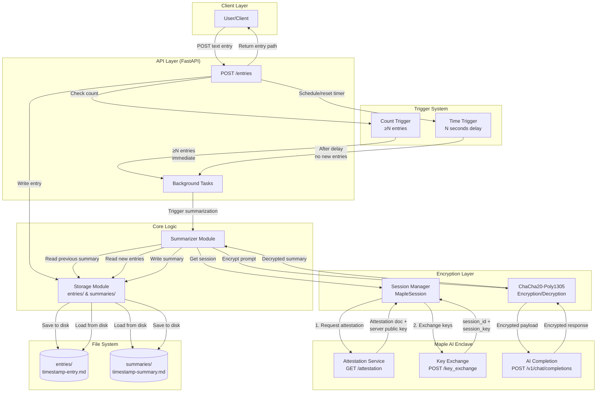
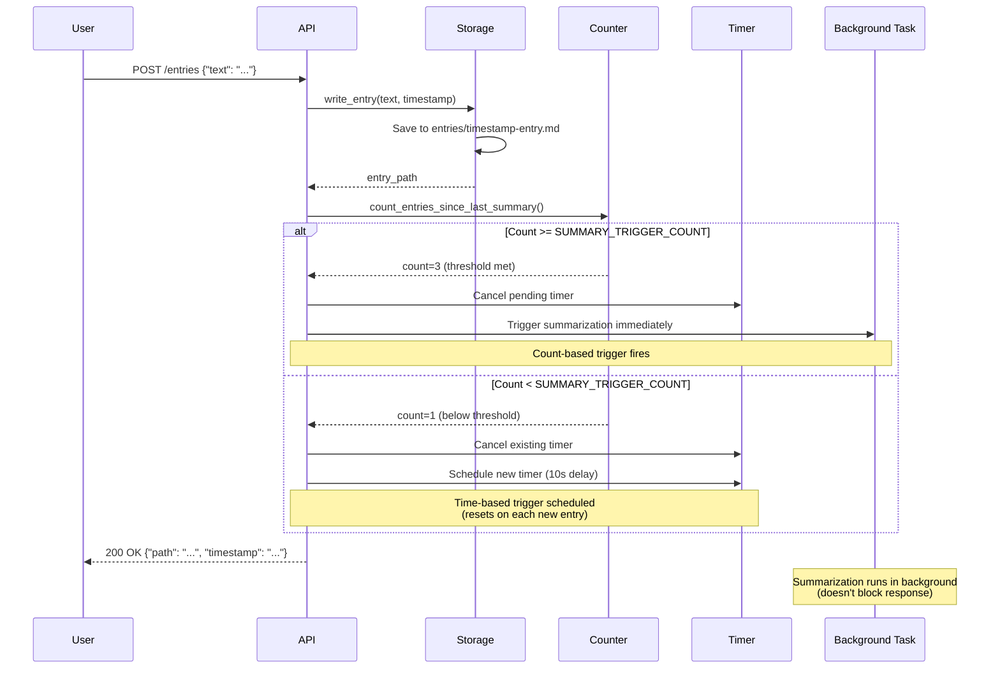
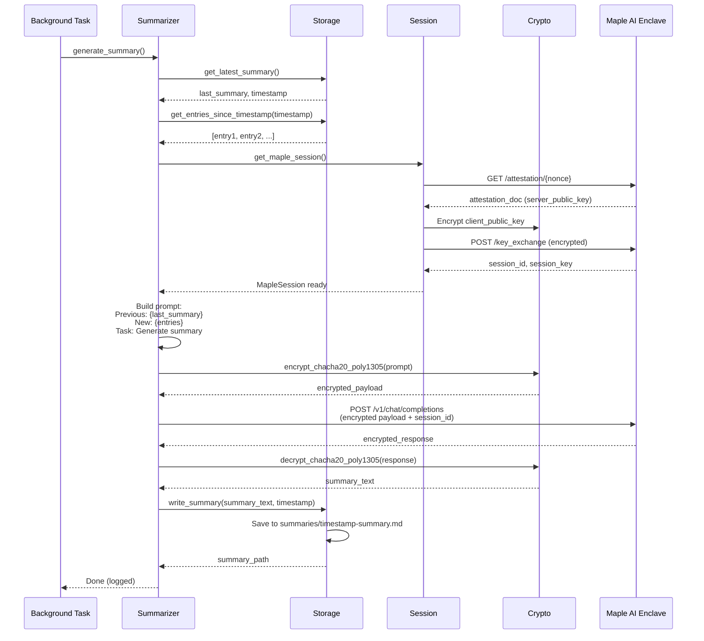
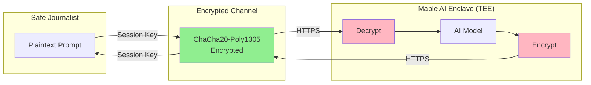

# Safe Journalist Architecture

High-level overview of how the Safe Journalist app works.

## System Architecture

## Data Flow: Entry Creation

## Data Flow: AI Summarization

## Configuration

| Variable | Default | Description |
|----------|---------|-------------|
| `DATA_DIR` | `/data` | Base directory for entries and summaries |
| `SUMMARY_TRIGGER_COUNT` | `3` | Trigger summarization after N entries |
| `SUMMARY_TRIGGER_DELAY` | `10` seconds | Trigger summarization after N seconds of inactivity |
| `MAPLE_API_URL` | `https://enclave.trymaple.ai` | Maple enclave API endpoint |
| `MAPLE_API_KEY` | (required) | API key for Maple service |
| `MAPLE_MODEL` | `llama-3.3-70b` | AI model to use for summarization |

## Key Components

### Storage Module (`storage.py`)
- Manages file I/O for entries and summaries
- Subdirectories: `entries/` and `summaries/`
- Timestamp-based filenames for ordering
- Helper functions for listing and counting

### Summarizer Module (`summarizer.py`)
- Orchestrates AI summarization flow
- Reads previous summary + new entries
- Constructs context-aware prompts
- Handles encrypted AI calls
- Writes summaries to disk

### Trigger System
- **Count-based**: Immediate trigger when threshold reached
- **Time-based**: Debounced timer (resets on each entry)
- Whichever fires first wins (other is cancelled)

### Encryption Layer
- **Session Management**: Attestation + key exchange
- **ChaCha20-Poly1305**: Symmetric encryption for requests/responses
- End-to-end encryption with AI enclave

## Security Model

**Key Properties:**
- Attestation verifies enclave identity (hackathon mode: extracts public key)
- Session key negotiated via Diffie-Hellman
- Only encrypted data leaves the client
- AI processing happens in trusted execution environment (TEE)
